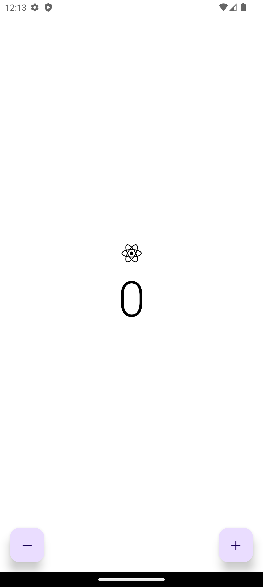

# Counter App

📱 Project Description

CounterApp is a minimalistic mobile application designed for both iOS and Android. Built on top of React Native with Expo, this application uses an intuitive approach for incrementing or decrementing the value of a counter. Its clean design makes for a smooth user experience while delivering native-like performance on all devices.

🚀 Key Features:

- Increment and decrement functionality with responsive UI updates
- Clean design for distraction-free usability
- Cross platform native behavior optimized for iOS and Android

## Screenshots

    

        
        
    

    

        
        
    

